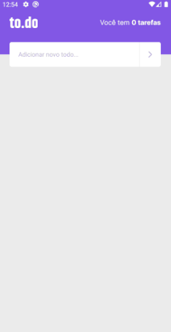

    

<h1 align="center">TO.DO</h1>

O objetivo desse projeto é fornecer uma interface simples e amigável para que o usuário tenha controle de suas tarefas.

<h1 align="center">
    
</h1>

## :rocket: Tecnologias

- [Expo](https://docs.expo.dev/)
- [React Native](https://reactnative.dev/)
- [Typescript](https://www.typescriptlang.org/)
- [styled-components](https://www.styled-components.com/)
- [VS Code](https://code.visualstudio.com/)

---

Feito com ❤️ por Lucas Robert 👋🏽 Entre em contato!

 
